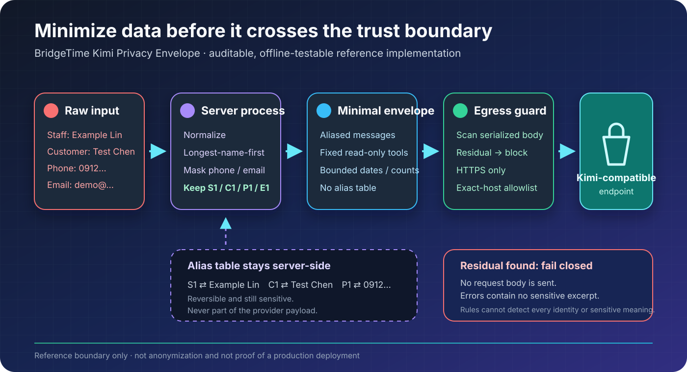

<div align="center">

# BridgeTime Kimi Privacy Envelope

**Minimize identifiable data into an auditable, testable envelope before it reaches an external
LLM.**

[繁體中文](README.md) · [English](README.en.md)

[](https://github.com/TokimiSpace/bridgetime-kimi-privacy/actions/workflows/ci.yml)
[](https://deno.com/)
[](LICENSE)
[](#verify-in-30-seconds)

[BridgeTime](https://bridgetime.org/) ·
[GitHub repository](https://github.com/TokimiSpace/bridgetime-kimi-privacy) ·
[TokimiSpace open-source hub](https://tokimispace.github.io/?lang=en) ·
[Tokimi website](https://tokimi.space/en/open-source/)

</div>

This independent, offline-testable TypeScript reference implementation shows how BridgeTime can
replace **known names, supported Taiwan phone formats, and email addresses** with aliases before
calling Kimi or another OpenAI-compatible LLM. It builds an `EgressEnvelopeV1` and performs a second
fail-closed scan immediately before egress.

> [!IMPORTANT]
> As of 2026-08-25, the production assistant at `bridgetime.org` is disabled. This public repository
> is derived from private BridgeTime commit `48f5e35659afc729828a20bd68130ac5cd1262ca` and adds
> deliberate hardening. It is not evidence of a production deployment and does not claim that rules
> can detect every kind of personal data.



## At a glance

| Stage                 | What happens                                                                                                     | What may cross the server boundary                                       |
| --------------------- | ---------------------------------------------------------------------------------------------------------------- | ------------------------------------------------------------------------ |
| 1. Build aliases      | Known staff/customers become `S1`/`C1`; phones and emails receive `P1`/`E1`                                      | Nothing yet                                                              |
| 2. Build envelope     | Normalize free text, apply aliases, and add only fixed system text plus three read-only tool schemas             | Aliased messages, dates, ranges, counts, status codes, and opaque tokens |
| 3. Scan egress        | Scan again for declared literals, email, supported phones, Taiwan-ID shapes, long numbers, and credential shapes | Any residual blocks the request                                          |
| 4. Provider transport | Require HTTPS, port 443, an exact hostname allowlist, and no redirects                                           | The validated provider wire body                                         |
| 5. Handle response    | Name restoration can happen only inside an adopter's trusted server boundary                                     | The alias table never enters the provider payload                        |

### Synthetic example

|                                   | Value                                                                  |
| --------------------------------- | ---------------------------------------------------------------------- |
| Raw input (server-side only)      | `林範例請聯絡陳測試，電話 0912-000-123，信箱 demo.person@example.test` |
| Actual demo outbound user message | `S1請聯絡C1,電話 P1,信箱 E1`                                           |
| Mapping kept server-side          | `S1 ⇄ 林範例`, `C1 ⇄ 陳測試`, `P1 ⇄ 0912…`, `E1 ⇄ demo…`               |

This is reversible **pseudonymization**, not anonymization. The alias table is itself sensitive; a
real system must separately implement access control, encryption, retention, and deletion.

## What it proves—and what it does not

| This repository demonstrates reproducibly                                                                           | This repository does not claim                                                                          |
| ------------------------------------------------------------------------------------------------------------------- | ------------------------------------------------------------------------------------------------------- |
| Known roster names, supported phones/emails, and caller-declared sensitive values are replaced or block the request | Arbitrary free text contains no personal data                                                           |
| The alias table and outbound envelope are separate objects; capture tests inspect the actual wire body              | Tokens such as `S1` and `C1` are truly anonymous                                                        |
| The model can request only `staff_on_shift`, `open_slots`, and `booking_stats`                                      | Schedule dates, time ranges, counts, and semantics remain entirely local                                |
| Tool schemas contain no `merchantId`, DB access, or writes; result serializers reject arbitrary free text           | The surrounding app already implements auth, tenant isolation, consent, retention, or incident response |
| URL, redirect, and error paths have explicit fail-closed controls                                                   | Code can guarantee Kimi's retention, training, cross-border, or subprocessor policy                     |
| Offline tests need no account, API key, database, network, or real data                                             | `bridgetime.org` currently deploys the same commit or has enabled an LLM                                |

Read [PRIVACY_LIMITATIONS.md](docs/PRIVACY_LIMITATIONS.md) for the exact claim and
[THREAT_MODEL.md](docs/THREAT_MODEL.md) for the trust boundaries and residual risks.

## Verify in 30 seconds

Install [Deno 2](https://docs.deno.com/runtime/getting_started/installation/), then run:

```bash
git clone https://github.com/TokimiSpace/bridgetime-kimi-privacy.git
cd bridgetime-kimi-privacy
deno task verify
deno task demo
```

- `verify` checks formatting, types, and the complete offline test suite.
- `demo` uses synthetic data and `CaptureTransport`. It **makes no network request**.
- The demo prints the actual outbound body, never the alias table, raw values, or API key.

Use [VERIFY.md](docs/VERIFY.md) to inspect each check and reproduce the manual adversarial cases.

## Minimal usage

This example prepares an envelope without connecting to a provider:

```ts
import { buildAliasTable, buildReadOnlyToolSchemas, prepareEgressEnvelopeV1 } from "./src/mod.ts";

const aliasTable = buildAliasTable(
  [{ id: "staff-synthetic-1", displayName: "林範例" }],
  [{ id: "customer-synthetic-1", displayName: "陳測試" }],
);

const prepared = prepareEgressEnvelopeV1({
  model: "kimi-k2.6",
  systemPrompt: "Use opaque tokens and read-only aggregate tools.",
  rawUserText: "林範例請聯絡陳測試，電話 0912-000-123",
  aliasTable,
  tools: buildReadOnlyToolSchemas({
    staffTokens: ["S1"],
    serviceTokens: ["V1"],
  }),
});

console.log(prepared.maskedUserText); // S1請聯絡C1,電話 P1
```

In a real integration, keep the alias table only in trusted server-side state. If the model requests
a tool, execute it inside your own authentication and tenant boundary, then append only a validated,
aliased result with `appendAliasedToolRoundTrip`. The `src/` package deliberately contains no
database executor; that is both a security and commercial boundary.

## Fixed read-only tools

| Tool             | Allowed information                                            | Explicitly excluded                                |
| ---------------- | -------------------------------------------------------------- | -------------------------------------------------- |
| `staff_on_shift` | Bounded period/date and an `S` staff token                     | Names, arbitrary IDs, `merchantId`, and writes     |
| `open_slots`     | Bounded period/date, a `V` service token, and aggregate counts | Service names, customer data, and free text        |
| `booking_stats`  | Bounded period/date, fixed status codes, and aggregate counts  | Individual booking rows, notes, phones, and emails |

The model still sees **aliased** dates, time ranges, and aggregate tool results on a second turn. Do
not claim that query results stay entirely local when using this flow.

## Repository map

```text
bridgetime-kimi-privacy/
├── src/
│   ├── alias.ts          # Reversible pseudonymization after normalization
│   ├── envelope.ts       # EgressEnvelopeV1 and two scan points
│   ├── provider.ts       # HTTPS, allowlist, redirect, and safe-error boundary
│   └── tools.ts          # Fixed read-only schemas and constrained serializers
├── tests/                # Capture, fail-closed, round-trip, and safe-error tests
├── examples/
│   └── synthetic_demo.ts # Zero-network, synthetic-only demonstration
└── docs/
    ├── DATA_FLOW.md
    ├── THREAT_MODEL.md
    ├── PRIVACY_LIMITATIONS.md
    ├── PROVIDER_DUE_DILIGENCE.md
    ├── SOURCE_MAPPING.md
    └── VERIFY.md
```

Suggested reading path: [data flow](docs/DATA_FLOW.md) → [verification guide](docs/VERIFY.md) →
[privacy limitations](docs/PRIVACY_LIMITATIONS.md) → [threat model](docs/THREAT_MODEL.md) →
[Kimi provider due diligence](docs/PROVIDER_DUE_DILIGENCE.md) →
[private/public source mapping](docs/SOURCE_MAPPING.md).

## Production activation gate

A green test run does not authorize real user data. BridgeTime or any adopter still needs, at
minimum:

- provider review covering retention, training/model improvement, data location, subprocessors, and
  deletion;
- accurate privacy notice, lawful basis/consent, cross-border mechanism, and data-subject workflows;
- encryption, access control, TTL/deletion, and backup policy for alias tables;
- authentication, tenant isolation, rate limits, body-free logging, key rotation, and a kill switch;
- a deployed commit or release digest connecting public evidence to the actual production artifact.

Kimi terms may change. Recheck [PROVIDER_DUE_DILIGENCE.md](docs/PROVIDER_DUE_DILIGENCE.md) before
activation. This repository and its documentation are not legal advice.

## Contributing, security, and licence

Contributions to detection rules, negative tests, documentation, and the provider boundary are
welcome. Use synthetic data only and read [CONTRIBUTING.md](CONTRIBUTING.md) first:

```bash
deno task verify
deno task demo
```

Report vulnerabilities privately through [SECURITY.md](SECURITY.md); do not place possible sensitive
data or exploit details in a public issue.

Code and documentation are available under [Apache License 2.0](LICENSE). BridgeTime and TokimiSpace
names and logos are not included; see [TRADEMARKS.md](TRADEMARKS.md). Kimi and Moonshot AI are
third-party names/marks used only to identify API compatibility and the reviewed provider boundary;
this repository is not affiliated with, sponsored by, or certified by Moonshot AI.
