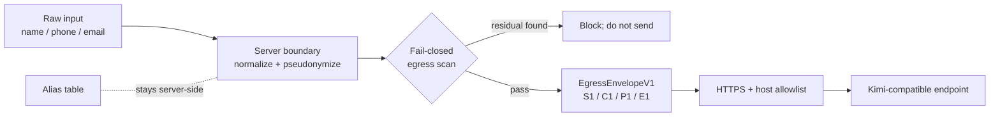

# BridgeTime Kimi Privacy Envelope

[中文](README.md) · [BridgeTime](https://bridgetime.org/) ·
[TokimiSpace Open Source](https://tokimi.space/en/open-source/)

An auditable, offline-testable TypeScript reference showing how BridgeTime can replace known
identities, supported Taiwan phone numbers, and email addresses with aliases before constructing a
minimal outbound envelope for Kimi or another OpenAI-compatible LLM.

> **Current status (2026-08-25):** the production assistant at `bridgetime.org` is disabled. This
> public repository is a hardened reference extraction derived from private BridgeTime commit
> `48f5e35659afc729828a20bd68130ac5cd1262ca`. It is not evidence of a production deployment and does
> not claim that every kind of personal data can be detected automatically.

## What this repository demonstrates



Anyone can inspect and test these properties:

- Raw known names, supported phone formats, and email addresses are absent from `EgressEnvelopeV1`.
- The alias table is separate from the provider payload. Sensitive values that are successfully
  replaced leave only as tokens such as `S1`, `C1`, `P1`, and `E1`; remaining meaning, dates, time
  ranges, and aggregates are still sent to the model.
- Three fixed read-only tool schemas expose no `merchantId`, database access, or write action.
- Tool results contain dates, counts, status codes, minute ranges, and opaque tokens only.
- A second egress scan blocks declared or detected residual values before transport.
- Provider URLs require HTTPS and an exact hostname match against an allowlist.
- Provider errors never include response bodies, request bodies, API keys, or input excerpts.

## What it does not prove

This is reversible **pseudonymization**, not anonymization. Unknown names, addresses, uncommon phone
formats, and sensitive meaning in free text may evade rule-based detection. Fail-closed behavior
applies to declared or detected residuals; it cannot magically identify all personal data. Read
[Privacy limitations](docs/PRIVACY_LIMITATIONS.md) and the [Threat model](docs/THREAT_MODEL.md)
before adapting the code. Complete the [Kimi provider due diligence](docs/PROVIDER_DUE_DILIGENCE.md)
before enabling any real provider.

## Verify in 30 seconds

Install [Deno 2](https://deno.com/), then run:

```bash
deno task verify
deno task demo
```

The demo uses synthetic data and a capture transport. It performs no network request and prints only
the outbound envelope, never the alias table or raw sensitive values.

## Layout

```text
src/       aliasing, envelope, egress policy, provider boundary, read-only tools
tests/     outbound capture, blocking, alias round-trip, and safe-error tests
examples/  synthetic, zero-network demonstration
docs/      data flow, threat model, limitations, source mapping, reproduction
```

Suggested path: [`DATA_FLOW.md`](docs/DATA_FLOW.md) → [`VERIFY.md`](docs/VERIFY.md) →
[`PROVIDER_DUE_DILIGENCE.md`](docs/PROVIDER_DUE_DILIGENCE.md) →
[`SOURCE_MAPPING.md`](docs/SOURCE_MAPPING.md).

## License and marks

Code and documentation are available under the [Apache License 2.0](LICENSE). The BridgeTime and
TokimiSpace names and logos are not licensed with the code; see [TRADEMARKS.md](TRADEMARKS.md).
Please report vulnerabilities privately as described in [SECURITY.md](SECURITY.md).
