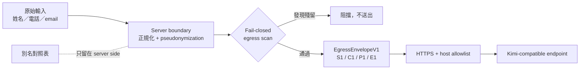

# BridgeTime Kimi Privacy Envelope

[English](README.en.md) · [BridgeTime](https://bridgetime.org/) ·
[TokimiSpace 開源專案](https://tokimi.space/open-source/)

一個可審查、可離線驗證的 TypeScript 參考實作，展示 BridgeTime 在呼叫 Kimi 等 OpenAI-compatible LLM
之前，如何先將已知身分、台灣電話與電子郵件轉為別名，再建立最小化的 outbound envelope。

> **目前狀態（2026-08-25）：** `bridgetime.org` 的 production assistant 目前為 disabled。這個公開
> repository 是由 private BridgeTime commit `48f5e35659afc729828a20bd68130ac5cd1262ca`
> 衍生、再加固的 reference extraction；它不是 production deployment
> 證明，也不代表所有個資都能被自動辨識。

## 我們要證明什麼



此 repo 讓任何人直接檢查並測試以下性質：

- 已知姓名、支援格式的電話與 email 不會放進 `EgressEnvelopeV1`。
- 別名對照表與 provider payload 分離；成功替換的敏感值只會以 `S1`、`C1`、`P1`、`E1` 等 token
  出境。剩餘語意、日期、時段與統計仍會送給模型。
- 工具只有三個固定的 read-only schema；沒有 `merchantId`、資料庫或寫入能力。
- 工具結果只序列化日期、數量、狀態碼、分鐘區間與 opaque token。
- 送出前再次掃描已宣告的敏感字串與可辨識格式；發現殘留就 fail closed。
- provider URL 必須是 HTTPS，hostname 必須精確命中 allowlist。
- provider 錯誤不回傳 response body、request body、API key 或輸入片段。

## 不能證明什麼

這是 **pseudonymization（可逆別名化）**，不是匿名化。未知姓名、地址、少見電話格式、
自由文字中的敏感語意，可能無法由規則自動辨識。Fail-closed 只對「已宣告」或「偵測到」
的殘留生效，不能神奇地辨識所有個資。完整邊界請讀 [隱私限制](docs/PRIVACY_LIMITATIONS.md) 與
[威脅模型](docs/THREAT_MODEL.md)。啟用任何真實 provider 前，也必須完成
[Kimi provider 審查](docs/PROVIDER_DUE_DILIGENCE.md)。

## 30 秒驗證

需要 [Deno 2](https://deno.com/)：

```bash
deno task verify
deno task demo
```

`demo` 使用合成資料與 capture transport，完全不連網。輸出只有 outbound envelope，
不會輸出別名對照表或原始敏感值。

## 專案結構

```text
src/       別名化、envelope、egress policy、provider boundary、read-only tools
tests/     outbound capture、阻擋條件、alias round-trip 與 safe-error 測試
examples/  純合成、零網路 demo
docs/      資料流、威脅模型、限制、來源對照與重現步驟
```

建議閱讀順序：[`DATA_FLOW.md`](docs/DATA_FLOW.md) → [`VERIFY.md`](docs/VERIFY.md) →
[`PROVIDER_DUE_DILIGENCE.md`](docs/PROVIDER_DUE_DILIGENCE.md) →
[`SOURCE_MAPPING.md`](docs/SOURCE_MAPPING.md)。

## 授權與品牌

程式碼與文件採 [Apache License 2.0](LICENSE)。BridgeTime、TokimiSpace 名稱與標誌
不包含在授權內；詳見 [TRADEMARKS.md](TRADEMARKS.md)。安全問題請勿公開建立 issue，請依
[SECURITY.md](SECURITY.md) 回報。
