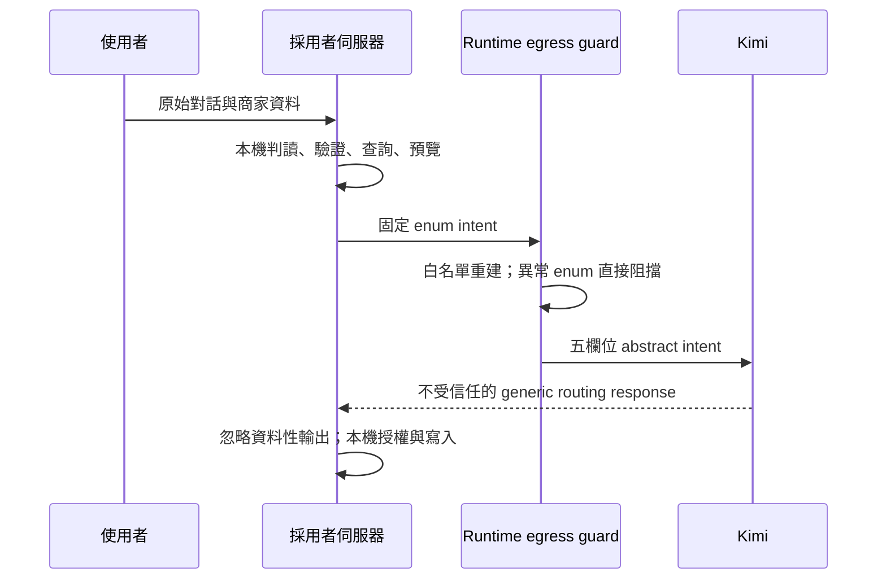
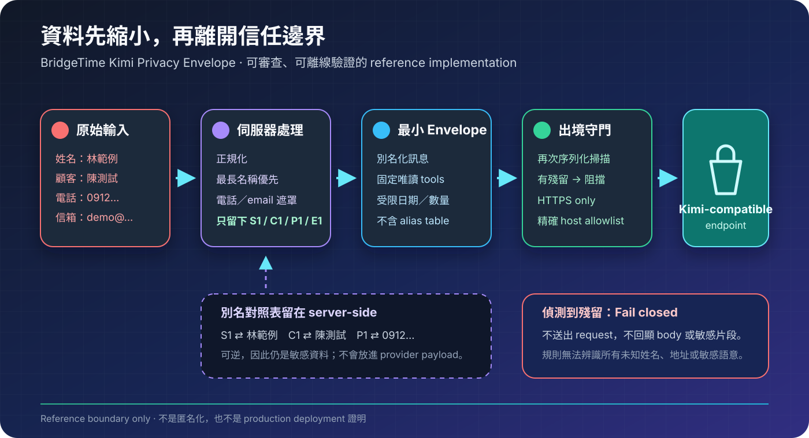

<div align="center">

# BridgeTime Kimi Privacy Envelope

**讓 Kimi 協助介面路由，不必看見姓名、服務、商家資料或原始對話。**

[繁體中文](README.md) · [English](README.en.md)

[](https://github.com/TokimiSpace/bridgetime-kimi-privacy/actions/workflows/ci.yml)
[](https://deno.com/)
[](LICENSE)

[BridgeTime](https://bridgetime.org/) ·
[TokimiSpace 開源首頁](https://tokimispace.github.io/?lang=zh-TW) ·
[Tokimi](https://tokimi.space/open-source/)

</div>

> [!WARNING]
> **防詐騙：**任何以 `@gmail.com` 結尾、並自稱 Tokimi
> 的帳號都不是官方聯絡管道。請勿付款或提供驗證碼；只透過 [tokimi.space](https://tokimi.space/) 或
> [ben@tokimi.space](mailto:ben@tokimi.space) 核實。

這是一個可離線驗證的 TypeScript 隱私邊界 reference implementation。`v0.2.0` 提供兩種明確分離的模式：

| 模式                       | Kimi 可看見                        | 適合用途                                | 隱私強度       |
| -------------------------- | ---------------------------------- | --------------------------------------- | -------------- |
| **Private Intent（推薦）** | 固定五欄位的抽象 enum              | 員工／服務 CRUD、對應關係、排班表單路由 | 不傳商家資料   |
| Pseudonymized Context      | 別名化訊息、代號、日期、時段與彙總 | 必須由模型閱讀語意或工具結果的實驗      | 仍有重識別風險 |

> [!IMPORTANT]
> 截至 **2026-08-28**，BridgeTime source 已在 private commit
> `215850f1469269c70bd58498272e219f5f8db45c` 導入 Private Intent 架構。實際網站是否啟用仍由部署環境
> 與 `LLM_API_KEY` 決定；本 repo 不是 production deployment 或供應商政策的證明。

## 推薦：零商家資料模式

原始對話、姓名、商家／服務名稱、內部 ID、數量、日期、時間、時區與歷史訊息都留在採用者自己的 server
boundary。自然語言判讀、資料庫查詢、權限檢查、預覽與寫入也都在本機完成。

採用者若在聊天輸入框提供關鍵字或完整句型小抄，應直接把已驗證的固定文字包在前端：展開說明不能送出
訊息、填入指令、寫入資料或呼叫 provider，範例也不應做成一鍵執行按鈕。提示需明確要求使用者不要輸入
PIN、邀請憑證、顧客姓名、電話或其他個資。

Kimi 只收到這種固定 envelope：

```json
{
  "schema": "bridgetime.private-intent.v1",
  "action": "create",
  "entity": "staff",
  "source": "structured_form",
  "stage": "preview"
}
```



### 最小整合

```ts
import { buildPrivateIntentEnvelopeV1, sendPrivateIntentEnvelope } from "./src/mod.ts";

// 原始文字與實際表單值必須先在自己的 server 內處理。
const envelope = buildPrivateIntentEnvelopeV1(
  "create_staff",
  "structured_form",
  "preview",
);

await sendPrivateIntentEnvelope({
  envelope,
  apiKey: Deno.env.get("LLM_API_KEY") ?? "",
});
```

`sendPrivateIntentEnvelope` 會再次從白名單重建物件；多餘欄位被丟棄，無效或不相容的 enum 在 transport
前 fail closed。Kimi endpoint 固定為 `https://api.moonshot.ai/v1`，模型固定為 `kimi-k2.6`，thinking
關閉，回覆上限 128 tokens，redirect 也會被拒絕。模型回覆不應決定 tenant、授權或資料庫寫入。

## 進階：別名化語境模式

若產品真的需要模型讀取自然語言或工具結果，可使用既有的 `EgressEnvelopeV1`。它會把已知姓名、支援的
台灣電話格式與 email 轉成 `S1`、`C1`、`P1`、`E1`，並在出境前做 fail-closed 掃描。



這是可逆的 **pseudonymization（別名化）**，不是 anonymization（匿名化）。服務代號、日期、時段、
數量與狀態仍可能送到模型，也可能透過組合重識別。能用 Private Intent 就不要用這個模式。

## 證據邊界

| 可重現地證明                                                                 | 不代表                                         |
| ---------------------------------------------------------------------------- | ---------------------------------------------- |
| Private Intent wire body 只含固定 prompt、tool schema、模型設定與五欄位 enum | Kimi 完全沒有收到任何 metadata                 |
| Runtime guard 會剝除額外欄位，異常 enum 在 transport 前阻擋                  | 周邊系統已有 auth、tenant isolation 或 consent |
| 官方 Kimi hostname、HTTPS:443 與拒絕 redirect 被固定                         | 可保證 provider 的保留、訓練、跨境或次處理政策 |
| Pseudonymized Context 會替換已知姓名與支援格式，並掃描實際 wire body         | 任意自由文字已匿名化或不含未知個資             |
| 錯誤只暴露固定 code，不反射 request／provider body                           | 基礎設施、APM、proxy 或備份不會另行記錄資料    |

詳細限制見 [PRIVACY_LIMITATIONS.md](docs/PRIVACY_LIMITATIONS.md)與
[THREAT_MODEL.md](docs/THREAT_MODEL.md)。

## 30 秒離線驗證

只需要 [Deno 2](https://docs.deno.com/runtime/getting_started/installation/)：

```bash
git clone https://github.com/TokimiSpace/bridgetime-kimi-privacy.git
cd bridgetime-kimi-privacy
deno task verify
deno task demo
```

`verify` 執行格式、型別與全部離線測試。測試含可辨識 canary、惡意額外欄位、錯誤 enum、實際 wire
capture、endpoint allowlist 與 body-free error。`demo` 只使用合成資料與
`CaptureTransport`，不發出網路 request，也不保存 API key。

## 上線前

零商家資料模式大幅縮小 provider 邊界，但不取代完整的系統與法律控制：

- authentication、tenant isolation、操作權限、一次性確認與 rate limit；
- TLS、資料庫／備份權限、body-free logging、secret rotation 與 kill switch；
- 準確的隱私告知、合法依據、跨境傳輸與資料當事人流程；
- provider retention、training、資料地區、subprocessor 與刪除條款審查。

Kimi 政策可能變更，啟用前請重查
[PROVIDER_DUE_DILIGENCE.md](docs/PROVIDER_DUE_DILIGENCE.md)。這不是法律意見。

## 文件、安全與授權

閱讀 [DATA_FLOW.md](docs/DATA_FLOW.md)、[VERIFY.md](docs/VERIFY.md)、
[SOURCE_MAPPING.md](docs/SOURCE_MAPPING.md)及 [CHANGELOG.md](CHANGELOG.md)。貢獻請只用合成資料並先讀
[CONTRIBUTING.md](CONTRIBUTING.md)；安全問題請依 [SECURITY.md](SECURITY.md) 私下回報。

程式碼與文件採 [Apache License 2.0](LICENSE)。BridgeTime、TokimiSpace 名稱與標誌不在授權內，詳見
[TRADEMARKS.md](TRADEMARKS.md)。Kimi 與 Moonshot AI 為第三方名稱；本 repo 不代表雙方有合作或認證。
