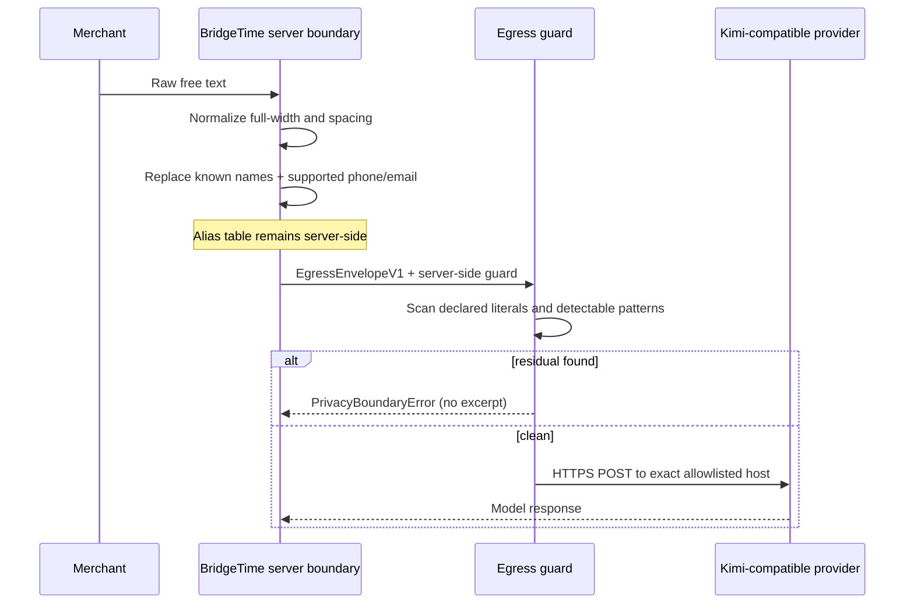

# Data flow

This document describes the reference package, not a claim about the current BridgeTime production
deployment.

## 1. Server-side inputs

The caller supplies a per-conversation alias table built from a known staff/customer roster. Staff
receive `S1..Sn`; customer order is shuffled and receives `C1..Cn`. The table contains reversible
values and is therefore sensitive server-side state.

Free text is normalized, then supported Taiwan mobile/landline values become `P` tokens and email
addresses become `E` tokens. Known names are replaced longest-first. The alias table is returned
separately and is never a field of `EgressEnvelopeV1`.

## 2. Envelope

`EgressEnvelopeV1` contains only:

- a model identifier and fixed purpose;
- controlled system text, previously aliased history, and the newly aliased user message;
- fixed read-only tool schemas;
- non-sensitive metadata naming the pseudonymization and fail-closed policy.

The model can still see business context represented in the envelope, including dates, counts,
status codes, time ranges, opaque staff/service tokens, and the semantic content that remains after
masking. Data minimization does not mean “no data.”

## 3. Read-only tool round trip

This repo does not query a database. A validated provider `tool_call` is restricted to a fixed tool
name, bounded call ID, allowlisted argument keys and schema-listed tokens. An adopter executes that
tool inside its authenticated boundary. `appendAliasedToolRoundTrip` then adds the assistant
`tool_calls` message and the matching local `tool` result together, so the provider never receives
an orphan tool message. The result serializer accepts dates, counts, minute ranges, fixed status
codes, and `S`/`V` tokens. It rejects arbitrary display names, service names, IDs, error text, or
free-text statuses.

## 4. Final egress checks

The envelope and the provider wire body are both scanned. The scan blocks:

- any value in the alias table or explicit `declaredSensitiveLiterals`;
- recognizable email, supported Taiwan phone, Taiwan national-ID shape, long digit run, or
  credential shape.

Detection codes may be logged; snippets and raw bodies must not be logged. The scan has no bypass
flag. If it finds a value, transport is not called.

## 5. Transport

The endpoint must use HTTPS, have no credentials/query/fragment, use port 443 (or the default), and
match an allowed hostname exactly. The included Kimi allowlist is `api.moonshot.ai`; adopters must
review any change to it. `FetchTransport` sets `redirect: "error"`, so a 3xx response cannot forward
the authorization header or request body to a second hostname.
