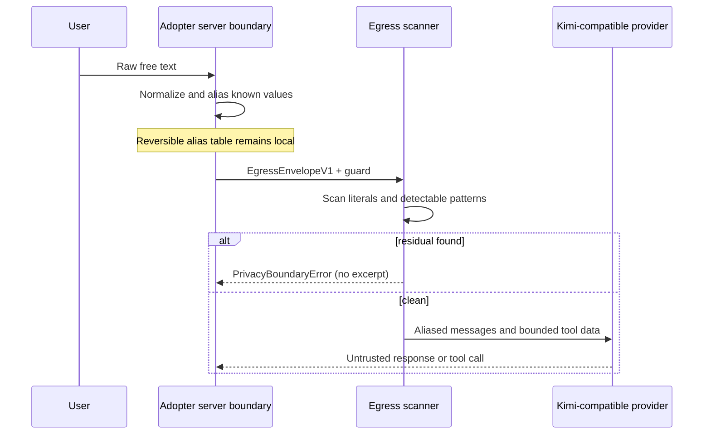

# Data flow

This package offers two deliberately separate egress modes. An adopter should use Private Intent
unless a product requirement genuinely needs model-visible language or aggregates. Neither mode is
proof of a live BridgeTime deployment.

## Mode A — Private Intent (recommended)

```mermaid
sequenceDiagram
  participant U as User
  participant S as Adopter server boundary
  participant G as Runtime egress guard
  participant P as Kimi

  U->>S: Raw chat + merchant values
  S->>S: Parse intent locally
  S->>S: Authenticate, query, validate, preview locally
  S->>G: PrivateIntentEnvelopeV1
  G->>G: Validate enum pair and rebuild five fields
  alt invalid envelope
    G-->>S: PrivacyBoundaryError (no excerpt)
  else valid
    G->>P: Fixed prompt + tool + abstract enum
    P-->>S: Untrusted generic routing response
    S->>S: Ignore data-bearing output; authorize/write locally
  end
```

### Local-only inputs

The raw message and all business values must remain local: merchant identity and label, person and
service names, internal IDs, counts, schedules, dates, times, timezone, and conversation history.
The package intentionally has no raw-text parser, database executor, tenant selector, or write tool.

### Provider-visible request

`sendPrivateIntentEnvelope` emits only:

- the pinned model `kimi-k2.6`, disabled thinking, and a 128-token output cap;
- a fixed system message that states the hidden values are unavailable;
- a fixed generic `choose_dialogue_strategy` schema;
- a canonical five-field `PrivateIntentEnvelopeV1`.

The five fields are `schema`, `action`, `entity`, `source`, and `stage`. Allowed action/entity pairs
are fixed. Before serialization, the runtime guard reconstructs a new object from those fields.
Unexpected properties are discarded; invalid enums block transport.

The provider learns the API account, connection timing, and an abstract operation class such as
`create/staff`. “Zero business data” does not mean zero metadata.

### Local outcome

The provider response is not returned as trusted business content. Authentication, tenant selection,
relationship checks, previews, confirmation tokens, and writes belong to the adopter's server. A
Kimi failure should not weaken those controls.

## Mode B — Pseudonymized Context (advanced)



This mode can expose semantic content, dates, counts, statuses, time ranges, and opaque
staff/service tokens. The alias table is reversible sensitive state. See `PRIVACY_LIMITATIONS.md`
before using it.

## Shared transport boundary

The endpoint must use HTTPS, have no credentials/query/fragment, use port 443, and match an allowed
hostname exactly. The Kimi allowlist is `api.moonshot.ai`. `FetchTransport` sets
`redirect: "error"`, preventing a redirect from forwarding the authorization header or body.
Provider bodies and request excerpts are never included in exported error metadata.
